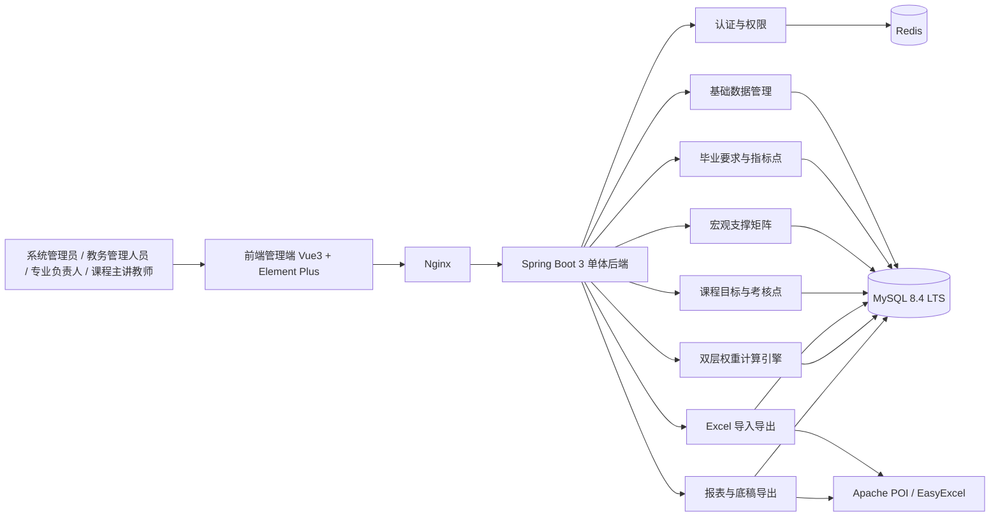
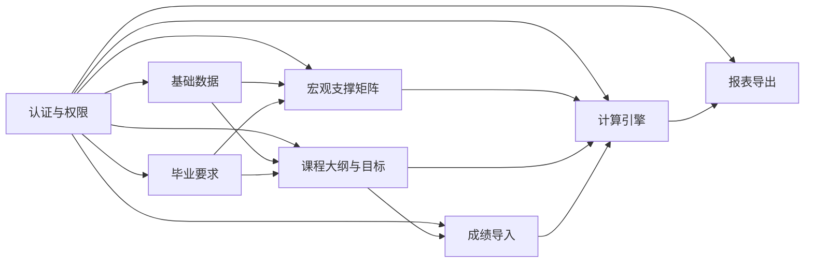
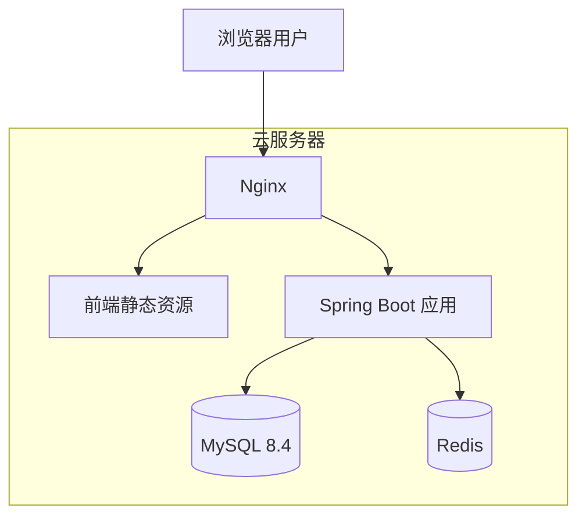

# 系统总体架构设计

## 1. 文档说明

本文档在研读《需求规格说明书》基础上，面向**整个项目周期**输出系统宏观架构规划，而不是仅针对第一周任务的临时设计。  
目标是明确：

- 系统边界与建设范围
- 技术栈与版本基线
- 整体分层架构
- 核心业务模块划分
- 关键数据流与计算链路
- 部署架构与运行环境
- 后续开发与演进方向

---

## 2. 需求背景与系统定位

本系统的目标是建设一个：

**面向专业认证的毕业要求达成度统一计算平台**

其核心价值不是普通教务管理，而是围绕“**直接评价**”形成一套从原始成绩到毕业要求达成度结果的可追溯计算链路。

根据《需求规格说明书》，系统需支持以下核心能力：

- 维护毕业要求及二级指标点
- 维护课程与指标点的宏观支撑矩阵
- 维护课程大纲、课程目标、考核点及微观映射关系
- 导入学生名单、教学班、原始成绩等基础数据
- 执行课程级与专业级达成度计算
- 输出课程级、专业级评价报表与可追溯底稿

---

## 3. 系统边界

根据需求规格说明书，系统边界必须严格控制如下：

### 3.1 系统包含的范围

- 本科专业认证中的直接评价数据处理
- 基础数据维护
- 毕业要求与指标点维护
- 课程目标与考核点维护
- 原始成绩导入
- 达成度计算
- 报表导出

### 3.2 系统不包含的范围

- 不包含问卷、访谈等间接评价模块
- 不依赖外部教务系统接口
- 不包含智能推荐、AI 自动决策功能
- 不负责教学过程本身的完整管理

### 3.3 角色范围

系统仅围绕以下 4 类业务角色展开：

- 系统管理员
- 教务管理人员
- 专业负责人
- 课程主讲教师

---

## 4. 技术路线与版本基线

本项目采用：

**Java 敏捷企业级生态（国内高校教务系统主流）**

### 4.1 后端技术栈

- `JDK 21 LTS`
- `Spring Boot 3.5.14`
- `MyBatis-Plus 3.5.14`
- `Maven 3.9.x`
- `Spring Security + JWT`
- `OpenAPI / Swagger`

### 4.2 Excel 数据处理

- 优先：`Apache POI 5.5.1`
- 备选：`EasyExcel 4.0.3`

### 4.3 前端技术栈

- `Node.js 22.12.0+ LTS`
- `Vue 3.5.21`
- `Vite 7.1.4`
- `Element Plus 2.11.2`
- `Sass 1.79.0+`
- `Pinia`
- `Vue Router`
- `Axios`

### 4.4 数据存储与运行环境

- `MySQL 8.4 LTS`
- `Redis`
- `Nginx`
- `Docker Engine`
- `Docker Compose`

---

## 5. 总体架构思路

### 5.1 架构结论

项目整体采用：

**前后端分离 + 模块化单体后端 + 容器化部署**

### 5.2 采用该方案的原因

- 项目业务逻辑完整，但开发周期有限，不宜一开始拆微服务
- 计算链路较强依赖事务一致性，单体架构更适合快速稳定落地
- 前后端分离有利于多人并行开发
- 模块化单体既能保证边界清晰，也为后续拆分服务留出空间

### 5.3 架构原则

- 业务单体优先，避免过度设计
- 模块边界清晰，便于分工
- MySQL 存储业务真值，Redis 只做缓存和临时状态
- 核心计算逻辑集中在后端统一执行
- 前端只负责展示、录入、触发和结果呈现

---

## 6. 系统总体架构图



---

## 7. 系统分层设计

整体建议分为 5 层。

### 7.1 表现层

职责：

- 用户界面展示
- 表单录入
- 列表查询
- 导入导出触发
- 报表展示

技术：

- Vue 3
- Element Plus
- Axios
- Pinia
- Vue Router

### 7.2 接口层

职责：

- 提供 RESTful API
- 参数校验
- 统一响应格式
- 登录鉴权

技术：

- Spring Boot Web
- Spring Security
- JWT

### 7.3 业务层

职责：

- 承载业务规则
- 实现权重校验
- 驱动计算过程
- 处理锁定机制

技术：

- Spring Service
- 事务管理
- 模块化业务服务

### 7.4 数据访问层

职责：

- 实体映射
- 数据读写
- 多表联查
- 持久化计算结果

技术：

- MyBatis-Plus
- Mapper / XML / Wrapper 查询

### 7.5 存储与基础设施层

职责：

- 关系数据存储
- 缓存支持
- 反向代理
- 容器化部署

技术：

- MySQL
- Redis
- Nginx
- Docker Compose

---

## 8. 模块划分与边界

后端采用“模块化单体”组织，建议划分如下模块。

### 8.1 认证与权限模块 `auth`

职责：

- 用户登录
- JWT 管理
- 基于角色的访问控制（RBAC）
- 用户、角色、权限关联

输入：

- 用户账号密码

输出：

- token
- 当前用户角色与菜单权限

### 8.2 基础数据模块 `basic`

职责：

- 学年学期
- 学院、专业
- 课程库
- 教学班
- 学生名单

说明：

- 该模块为其他业务模块提供主数据支撑

### 8.3 毕业要求模块 `requirement`

职责：

- 毕业要求维护
- 二级指标点维护
- 毕业要求层级结构维护

说明：

- 负责“指标体系定义”，不负责成绩计算

### 8.4 宏观支撑矩阵模块 `matrix`

职责：

- 维护“课程 - 指标点”支撑关系
- 维护支撑等级 `H/M/L`
- 维护课程总支撑权重 `W`
- 校验同一指标点下课程总权重之和

说明：

- 属于宏观层映射

### 8.5 课程大纲模块 `syllabus`

职责：

- 课程目标维护
- 考核点维护
- 课程目标与指标点的内部映射关系维护
- 课程目标贡献权重 `w` 维护

说明：

- 属于微观层映射

### 8.6 成绩导入模块 `import`

职责：

- Excel 模板生成
- 学生名单导入
- 课程库导入
- 原始成绩导入
- 数据格式校验

说明：

- 负责“导入和校验”，不直接承担最终计算

### 8.7 计算模块 `calc`

职责：

- 课程目标达成度计算
- 课程级指标点达成度计算
- 专业级指标点达成度计算
- 权重合法性校验
- 数据锁定控制

说明：

- 是整个系统的核心引擎模块

### 8.8 报表模块 `report`

职责：

- 课程级评价报表
- 专业级评价报表
- 可追溯底稿导出

说明：

- 面向结果输出，不承担核心规则运算

---

## 9. 模块关系图



---

## 10. 核心计算链路设计

系统核心采用《需求规格说明书》中的双层权重计算链路。

### 10.1 计算链路总体说明

本系统采用“**宏观矩阵 + 微观大纲**”相分离的双层权重模式，核心目标是把底层原始成绩逐步汇总到顶层毕业要求指标点结果，并保证全链路可追溯。

整体链路如下：

`原始成绩 -> 考核点 -> 课程目标达成度 -> 课程级指标点达成度 -> 专业级指标点达成度`

其中：

- **考核点** 是最底层的评价单元，例如“实验1”“期中第2题”“期末大题A”
- **课程目标** 是课程内部的教学目标单元
- **指标点** 是毕业要求中的二级指标点
- **w** 是课程内部“课程目标 -> 指标点”的贡献权重
- **W** 是专业层面“课程 -> 指标点”的总支撑权重

### 10.2 计算所依赖的基础数据

计算模块启动前，至少需要具备以下数据：

#### 10.2.1 基础主数据

- 专业
- 课程
- 教学班
- 学生名单

#### 10.2.2 宏观配置数据

- 毕业要求
- 指标点
- 课程与指标点支撑关系
- 课程对指标点的总支撑权重 `W`

#### 10.2.3 微观配置数据

- 课程目标
- 考核点
- 考核点所属课程目标
- 课程目标对指标点的内部贡献权重 `w`

#### 10.2.4 原始成绩数据

- 学生在每个考核点上的实际得分
- 每个考核点的满分值

如果以上任一关键数据缺失，计算模块不允许正式执行。

### 10.3 第一层：课程目标级达成度计算

#### 10.3.1 计算目的

先在课程内部，计算每个学生在每个课程目标上的达成情况，再汇总为班级在该课程目标上的平均达成度。

#### 10.3.2 计算粒度

- 单个学生 + 单个课程目标
- 单个教学班 + 单个课程目标

#### 10.3.3 计算逻辑

对于学生 `i` 和课程目标 `j`：

```text
Cij = (该学生在所有支撑目标 j 的考核点上的实际得分之和)
      /
      (所有支撑目标 j 的考核点满分之和)
```

之后，对同一教学班内所有学生的 `Cij` 求平均，得到班级课程目标达成度：

```text
Cj_bar = 班级内所有学生在课程目标 j 上达成度的平均值
```

#### 10.3.4 输入与输出

输入：

- 学生成绩明细
- 考核点与课程目标映射关系
- 考核点满分值

输出：

- 学生-课程目标达成度
- 教学班-课程目标平均达成度

#### 10.3.5 典型场景

例如：

- 课程目标 O1 由“平时作业1”“实验1”“期中第2题”共同支撑
- 某学生在这些考核点上的总得分为 34
- 这些考核点总满分为 40

则该学生在目标 O1 上的达成度为：

```text
34 / 40 = 0.85
```

### 10.4 第二层：课程级指标点达成度计算

#### 10.4.1 计算目的

在单门课程内部，把多个课程目标的达成情况，按照内部贡献权重 `w` 汇总为课程对某一指标点的支撑达成度。

#### 10.4.2 计算粒度

- 单个教学班 + 单门课程 + 单个指标点

#### 10.4.3 计算逻辑

课程对指标点 `k` 的达成度记为 `Ek`：

```text
Ek = Σ (Cj_bar × wjk)
```

其中：

- `Cj_bar`：教学班在课程目标 `j` 上的平均达成度
- `wjk`：课程目标 `j` 对指标点 `k` 的内部贡献权重

#### 10.4.4 约束规则

对同一门课程、同一个指标点 `k`，所有相关课程目标的内部权重必须满足：

```text
Σ wjk = 1.0
```

如果不满足：

- 系统不允许正式计算
- 前端需给出红色校验提示
- 后端计算接口应返回明确错误信息

#### 10.4.5 输入与输出

输入：

- 教学班课程目标平均达成度
- 课程目标与指标点内部映射关系
- 内部贡献权重 `w`

输出：

- 教学班-课程-指标点达成度

### 10.5 第三层：专业级指标点达成度计算

#### 10.5.1 计算目的

将多门课程对同一指标点的支撑结果，按照宏观总支撑权重 `W` 汇总，形成专业级最终达成度。

#### 10.5.2 计算粒度

- 单个专业 + 单个指标点

#### 10.5.3 计算逻辑

专业在指标点 `k` 上的最终达成度记为 `Gk`：

```text
Gk = Σ (Ek × Wc)
```

其中：

- `Ek`：某门课程对指标点 `k` 的课程级达成度
- `Wc`：该课程对指标点 `k` 的总支撑权重

#### 10.5.4 约束规则

对同一个指标点 `k`，所有支撑课程的总支撑权重必须满足：

```text
Σ Wc = 1.0
```

如果不满足：

- 系统不允许执行专业级汇总计算
- 需提示专业负责人先修正宏观支撑矩阵

#### 10.5.5 输入与输出

输入：

- 各课程对指标点的课程级达成度
- 课程-指标点宏观支撑矩阵
- 总支撑权重 `W`

输出：

- 专业-指标点最终达成度

### 10.6 计算前置校验

正式执行计算前，系统需依次完成以下检查：

#### 10.6.1 配置完整性校验

- 是否已维护课程目标
- 是否已维护考核点
- 是否已维护 `w`
- 是否已维护 `W`
- 是否已导入原始成绩

#### 10.6.2 权重合法性校验

- 同一课程、同一指标点下 `Σw = 1.0`
- 同一专业、同一指标点下 `ΣW = 1.0`

#### 10.6.3 数据合法性校验

- 考核点满分是否大于 0
- 学生成绩是否为空
- 是否存在非法分值
- 是否存在未映射课程目标的考核点

只有在所有校验通过后，系统才允许正式提交计算任务。

### 10.7 计算触发机制

#### 10.7.1 阶段一：教师级触发

责任角色：

- 课程主讲教师

触发条件：

- 本课程成绩导入完成
- 课程大纲与权重配置完整

执行内容：

- 计算课程目标达成度
- 计算课程级指标点达成度
- 保存课程级计算结果

执行结果：

- 该课程进入“已计算”状态
- 如教师确认无误，可进一步进入“已锁定”状态

#### 10.7.2 阶段二：全局级触发

责任角色：

- 专业负责人
- 教务管理人员

触发条件：

- 所有相关课程均完成阶段一计算
- 宏观支撑矩阵合法

执行内容：

- 汇总各课程级指标点达成度
- 计算专业级指标点最终达成度
- 持久化专业级计算结果

执行结果：

- 生成专业级评价结果
- 为报表导出模块提供数据

### 10.8 计算结果持久化设计

建议将计算结果分层存储，而不是只保留最终值：

#### 10.8.1 第一层结果

- 学生-课程目标达成度
- 教学班-课程目标平均达成度

#### 10.8.2 第二层结果

- 教学班-课程-指标点达成度

#### 10.8.3 第三层结果

- 专业-指标点最终达成度

这样做的好处是：

- 支持逐层追溯
- 支持复核计算过程
- 支持后续报表钻取

### 10.9 计算锁定机制

为保证成绩和结果的一致性，系统需要引入锁定机制。

#### 10.9.1 锁定对象

- 原始成绩数据
- 课程级计算结果

#### 10.9.2 锁定时机

- 教师完成阶段一计算并确认结果后

#### 10.9.3 锁定后限制

- 原始成绩不可直接修改
- 权重关系不可直接修改
- 如确需修改，必须先由有权限人员解锁

#### 10.9.4 锁定目的

- 防止“边计算边改成绩”导致结果失真
- 保证课程级结果可作为专业级汇总的稳定输入

### 10.10 失败回滚与重算机制

系统计算必须具备失败回滚能力。

#### 10.10.1 失败回滚

如果在计算过程中发生：

- 权重校验失败
- 数据非法
- 数据库写入异常
- 结果持久化失败

则本次计算应整体回滚，不保留半成品结果。

#### 10.10.2 重算机制

在以下情形中允许重算：

- 尚未锁定的课程
- 已解锁课程
- 专业级结果需要重新汇总

系统应记录：

- 计算时间
- 触发人
- 版本号或批次号
- 重算原因

### 10.11 核心计算链路总结

本系统的计算并不是简单加权平均，而是一个分三层传导、两阶段触发、全程可追溯的过程：

1. 先从原始成绩计算课程目标达成度
2. 再由课程目标达成度汇总出课程级指标点达成度
3. 最后由课程级结果汇总出专业级指标点最终达成度

这条链路是整个系统最核心的业务价值所在，也是数据库设计、权限设计、锁定机制和报表设计的共同基础。

---

## 11. 关键数据流设计

### 11.1 基础数据流

`管理员/教务 -> 基础数据录入 -> MySQL`

包括：

- 专业
- 课程
- 教学班
- 学生名单

### 11.2 宏观配置数据流

`专业负责人 -> 毕业要求/指标点 -> 宏观支撑矩阵 -> MySQL`

### 11.3 微观配置数据流

`课程主讲教师 -> 课程目标/考核点/内部权重 -> MySQL`

### 11.4 成绩数据流

`Excel 成绩表 -> 导入模块 -> 数据校验 -> MySQL`

### 11.5 结果数据流

`成绩 + 权重配置 -> 计算模块 -> 达成度结果表 -> 报表模块`

---

## 12. 部署架构设计



### 12.1 部署方式

采用 `Docker Compose` 统一编排，包含：

- 前端静态资源服务
- Spring Boot 应用服务
- MySQL 服务
- Redis 服务
- Nginx 反向代理

### 12.2 Nginx 职责

- 提供前端静态资源访问
- 代理 `/api` 请求到后端
- 后续可扩展 HTTPS 和统一入口

### 12.3 Redis 职责

- 登录态辅助
- 字典数据缓存
- 临时状态缓存

### 12.4 MySQL 职责

- 存储系统全部核心业务数据
- 存储成绩、映射关系、计算结果
- 保证事务一致性

---

## 13. 数据库与性能设计要求

### 13.1 数据库版本

- `MySQL 8.4 LTS`

### 13.2 事务要求

系统涉及“成绩导入、阶段一计算、阶段二汇总、成绩锁定”等关键写操作，事务隔离级别至少需要在 `Read Committed` 和 `Repeatable Read` 之间做出明确选择。

#### 13.2.1 Read Committed

含义：

- 一个事务只能读取到其他事务**已经提交**的数据
- 但同一事务中两次读取同一行数据，结果可能不同

优点：

- 并发能力较好
- 锁冲突相对较少
- 对更新频繁场景更友好

缺点：

- 可能出现**不可重复读**
- 在长事务计算场景下，如果中途有数据被提交修改，前后两次读取结果可能不一致

适用场景：

- 普通列表查询
- 对一致性要求没那么高的后台管理读操作

#### 13.2.2 Repeatable Read

含义：

- 在同一事务内，多次读取同一行数据时，结果保持一致
- 更适合需要“读取后再计算再落库”的场景

优点：

- 能减少不可重复读问题
- 更适合成绩锁定、计算汇总、结果持久化等强一致性业务

缺点：

- 相比 `Read Committed`，并发下锁竞争可能更明显
- 事务写入路径设计不当时，性能压力会更高

适用场景：

- 课程级计算
- 专业级汇总计算
- 锁定状态更新
- 对一致性要求高的批量业务处理

#### 13.2.3 两者区别总结

| 对比项 | Read Committed | Repeatable Read |
|---|---|---|
| 是否能读到未提交数据 | 否 | 否 |
| 同一事务两次查询结果是否可能变化 | 可能 | 一般不变 |
| 一致性强度 | 中等 | 较高 |
| 并发性能 | 较好 | 略低于 Read Committed |
| 适合本项目哪些场景 | 普通查询 | 计算、锁定、汇总 |

#### 13.2.4 本项目建议

建议默认采用：

- `Repeatable Read`

原因：

- 本项目核心价值在于“计算结果可信、链路可追溯”
- 计算链路涉及多表查询、汇总、持久化与锁定
- 比起极致吞吐，更优先保证计算过程中的一致性

同时可以补充策略：

- 对普通后台读操作，可在实现层面尽量缩短事务范围
- 对复杂计算任务，坚持使用更稳妥的一致性方案
- 后续若压测发现锁竞争明显，再评估局部读场景切换为 `Read Committed`

### 13.3 索引要求

针对高频计算链路，应重点考虑以下字段：

- `CourseID`
- `ObjectiveID`
- `IndicatorID`

建议在以下场景建立联合索引：

- 课程与指标点映射关系表
- 课程目标与指标点映射关系表
- 成绩明细表
- 教学班与课程查询表

---

## 14. 安全与权限设计

### 14.1 认证方式

- 采用账号密码登录
- 后端签发 JWT
- 前端请求头携带 token

### 14.2 授权方式

采用 RBAC：

- 系统管理员
- 教务管理人员
- 专业负责人
- 课程主讲教师

### 14.3 权限控制层级

- 菜单级
- 页面级
- 接口级
- 操作级

---

## 15. 非功能性设计考虑

### 15.1 可维护性

- 单体架构降低系统复杂度
- 模块边界清晰，方便组内分工

### 15.2 可扩展性

- 后续可按模块逐步拆分服务
- Excel 导入、计算、报表可独立演进

### 15.3 一致性

- 核心业务数据以 MySQL 为准
- Redis 不存真值数据
- 计算结果统一后端生成

### 15.4 可部署性

- 基于 Docker Compose 快速部署
- 适合课程项目服务器演示与联调

---

## 16. 后续演进建议

项目第一阶段不建议引入微服务；如后期复杂度增长，可考虑：

1. 将认证权限模块独立
2. 将 Excel 导入导出拆为独立任务服务
3. 将计算引擎拆为独立计算服务
4. 将报表模块拆为独立报表服务

但在当前阶段，更优先的目标是：

**稳定实现业务闭环，而不是过早引入分布式复杂度**

---

## 17. 结论

本项目总体架构最终建议为：

- 前端：`Vue3 + Element Plus` 后台 SPA
- 后端：`Spring Boot 3 + MyBatis-Plus` 模块化单体
- 数据库：`MySQL 8.4 LTS`
- 缓存：`Redis`
- 代理：`Nginx`
- 部署：`Docker Compose`

该架构既满足《需求规格说明书》要求，也适合当前小组规模和 7 周开发周期，能够为后续数据库设计、前后端开发、联调测试和部署演示提供统一、稳定的系统基础。
