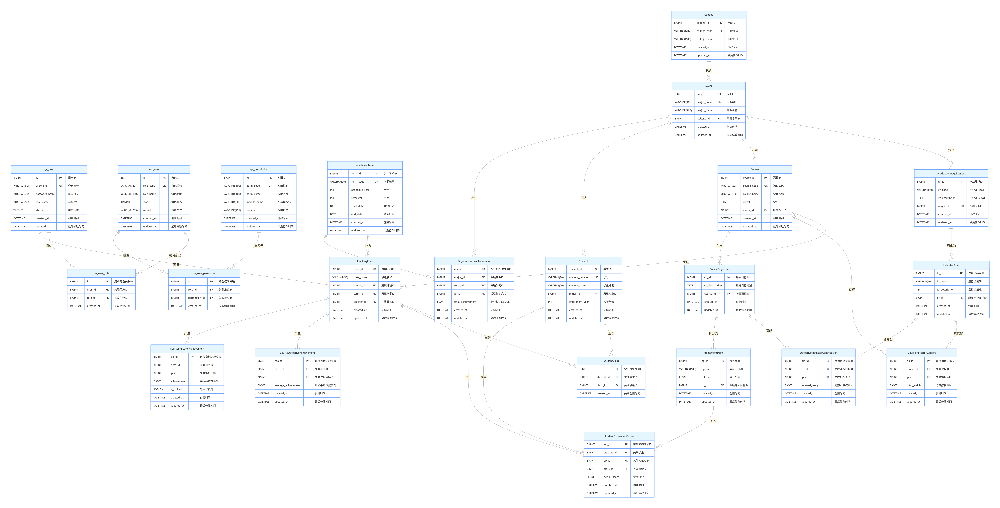

# 实体关系详细说明

## 一、整体关系架构概述
本数据库采用分层模块化设计，实体关系严格遵循 OBE 教育理念的 "目标 - 支撑 - 考核 - 达成" 逻辑链条，形成从 "基础组织数据"→"毕业要求体系"→"课程教学数据"→"考核成绩数据"→"达成度计算结果" 的完整闭环。所有实体通过外键约束建立关联，保证数据的参照完整性和可追溯性。

## 二、分模块实体关系说明

### 2.1 标准 RBAC 权限体系模块
**核心实体**
- sys_user（系统用户）：所有系统操作者的基础信息
- sys_role（系统角色）：预定义的四类业务角色（系统管理员、教务管理员、专业负责人、课程主讲教师）
- sys_permission（系统权限）：系统功能的最小操作单元

**关联实体**
- sys_user_role（用户 - 角色关联）：实现用户与角色的多对多关系
- sys_role_permission（角色 - 权限关联）：实现角色与权限的多对多关系

**关系说明**
1. **用户 ↔ 角色（多对多）**
一个用户可以拥有多个角色（如某教师同时担任专业负责人和课程主讲教师）
一个角色可以分配给多个用户（如多个教师都拥有 "课程主讲教师" 角色）
通过sys_user_role关联表实现，添加联合唯一约束防止重复分配

2. **角色 ↔ 权限（多对多）**
一个角色可以拥有多个权限（如专业负责人拥有毕业要求管理、支撑矩阵配置等权限）
一个权限可以授予多个角色（如报表导出权限可同时授予教务管理员和专业负责人）
通过sys_role_permission关联表实现，添加联合唯一约束防止重复绑定

3. **用户 ↔ 教学班级（一对多）**
一个用户（主讲教师）可以主讲多个教学班级
一个教学班级只能有一个主讲教师
通过TeachingClass.teacher_id外键关联sys_user.id实现

---

### 2.2 基础组织与时间模块
**核心实体**
- College（学院）：学校的二级教学单位
- Major（专业）：学院下设的本科专业
- AcademicTerm（学年学期）：时间维度的核心基准

**关系说明**
1. **学院 ↔ 专业（一对多）**
一个学院包含多个专业
一个专业只能属于一个学院
通过Major.college_id外键关联College.college_id实现

2. **学年学期 ↔ 教学班级（一对多）**
一个学年学期包含多个教学班级
一个教学班级只能属于一个学年学期
通过TeachingClass.term_id外键关联AcademicTerm.term_id实现

3. **学年学期 ↔ 专业级达成度（一对多）**
一个学年学期对应多个专业的达成度计算结果
一个专业在一个学年学期只能有一套最终达成度数据
通过MajorIndicatorAchievement.term_id外键关联实现

---

### 2.3 毕业要求体系模块
**核心实体**
- GraduationRequirement（毕业要求）：专业层面的顶层培养目标
- IndicatorPoint（二级指标点）：毕业要求的细化分解，是达成度计算的最小单元

**关系说明**
1. **专业 ↔ 毕业要求（一对多）**
一个专业定义多套毕业要求（不同年级可能有不同版本）
一套毕业要求只能属于一个专业
通过GraduationRequirement.major_id外键关联实现，添加联合唯一约束保证同一专业内毕业要求编码唯一

2. **毕业要求 ↔ 二级指标点（一对多）**
一个毕业要求细化为多个二级指标点
一个二级指标点只能属于一个毕业要求
通过IndicatorPoint.gr_id外键关联实现，添加联合唯一约束保证同一毕业要求内指标点编码唯一

---

### 2.4 课程与教学模块
**核心实体**
- Course（课程）：专业培养方案中的课程基本信息
- TeachingClass（教学班级）：课程在特定学期的具体教学实例
- Student（学生）：本科学生基础信息

**关联实体**
- StudentClass（学生 - 班级关联）：实现学生与教学班级的多对多关系

**关系说明**
1. **专业 ↔ 课程（一对多）**
一个专业开设多门课程
一门课程只能属于一个专业
通过Course.major_id外键关联实现

2. **专业 ↔ 学生（一对多）**
一个专业招收多名学生
一名学生只能属于一个专业
通过Student.major_id外键关联实现

3. **课程 ↔ 教学班级（一对多）**
一门课程在不同学期可以开设多个教学班级
一个教学班级只能对应一门课程
通过TeachingClass.course_id外键关联实现

4. **学生 ↔ 教学班级（多对多）**
一名学生可以选修多个教学班级的课程（支持跨专业选课和重修）
一个教学班级包含多名学生
通过StudentClass关联表实现，添加联合唯一约束防止学生重复加入同一班级

---

### 2.5 支撑关系模块（本项目核心特色）
本模块实现需求中的 **"宏观矩阵 - 微观大纲" 双层权重设计**，是达成度计算的核心逻辑。

**核心实体**
- CourseObjective（课程目标）：单门课程的教学目标
- CourseIndicatorSupport（课程 - 指标点宏观支撑）：宏观支撑矩阵，存储课程对指标点的总支撑权重 W
- ObjectiveIndicatorContribution（课程目标 - 指标点内部贡献）：微观大纲权重，存储课程目标对指标点的内部贡献权重 w

**关系说明**
1. **课程 ↔ 课程目标（一对多）**
一门课程包含多个课程目标
一个课程目标只能属于一门课程
通过CourseObjective.course_id外键关联实现

2. **课程 ↔ 二级指标点（多对多，带权重属性）**
一门课程可以支撑多个二级指标点
一个二级指标点可以被多门课程支撑
通过CourseIndicatorSupport关联表实现，存储总支撑权重 W
关键业务约束：同一指标点所有支撑课程的权重之和必须等于 1.0

3. **课程目标 ↔ 二级指标点（多对多，带权重属性）**
一个课程目标可以贡献于多个二级指标点
一个二级指标点可以被多个课程目标贡献
通过ObjectiveIndicatorContribution关联表实现，存储内部贡献权重 w
关键业务约束：同一课程内，同一指标点所有关联课程目标的权重之和必须等于 1.0

---

### 2.6 考核与成绩模块
**核心实体**
- AssessmentPoint（考核点）：课程考核的最小单元（如 "期末卷第 1 题"）
- StudentAssessmentScore（学生考核点成绩）：存储每个学生在每个考核点的原始得分

**关系说明**
1. **课程目标 ↔ 考核点（一对多）**
一个课程目标拆分为多个考核点
一个考核点只能绑定到一个课程目标
通过AssessmentPoint.co_id外键关联实现

2. **学生 ↔ 考核点 ↔ 教学班级（多对多，带成绩属性）**
一名学生在一个教学班级中可以有多个考核点的成绩
一个考核点在一个教学班级中对应多名学生的成绩
通过StudentAssessmentScore关联表实现，同时关联学生、考核点和教学班级三个实体
关键业务约束：同一个学生在同一个班级的同一个考核点只能有一条成绩记录
数据约束：实际得分不能超过考核点满分，也不能为负数

---

### 2.7 计算结果模块
本模块存储三级达成度计算结果，实现数据的持久化和可追溯。

**核心实体**
- CourseObjectiveAchievement（课程目标达成度）：第一级计算结果，班级层面各课程目标的平均达成度
- CourseIndicatorAchievement（课程级指标点达成度）：第二级计算结果，单门课程对各指标点的达成度
- MajorIndicatorAchievement（专业级指标点达成度）：第三级计算结果，专业层面各指标点的最终达成度

**关系说明**
1. **教学班级 ↔ 课程目标达成度（一对多）**
一个教学班级产生多个课程目标达成度记录（每个课程目标一条）
一个课程目标达成度记录只能属于一个教学班级
通过CourseObjectiveAchievement.class_id外键关联实现

2. **教学班级 ↔ 课程级指标点达成度（一对多）**
一个教学班级产生多个课程级指标点达成度记录（每个支撑的指标点一条）
一个课程级指标点达成度记录只能属于一个教学班级
通过CourseIndicatorAchievement.class_id外键关联实现
关键业务字段：is_locked标识该课程数据是否已锁定，锁定后禁止修改

3. **专业 ↔ 学年学期 ↔ 专业级指标点达成度（一对多）**
一个专业在一个学年学期产生多个专业级指标点达成度记录（每个指标点一条）
一个专业级指标点达成度记录只能属于一个专业和一个学年学期
通过MajorIndicatorAchievement.major_id和term_id外键关联实现

---

## 三、数据流转关系图
原始数据录入(教师操作) → 考核点成绩(Cij) → 课程目标达成度(Cj¯) → 课程级指标点达成度(Ek) → 专业级指标点达成度(Gk)

---

## 四、关键业务约束汇总
| 约束类型 | 具体内容 |
|--------|----------|
| 权重约束 | 所有支撑权重（W 和 w）范围为 0-1，且同一指标点的所有相关权重之和必须等于 1.0 |
| 数据锁定约束 | 课程级达成度计算完成后自动锁定，禁止修改原始成绩和权重 |
| 计算前置约束 | 专业级计算必须在所有相关课程的课程级计算完成并锁定后才能执行 |
| 唯一性约束 | 所有编码字段和关联关系均添加唯一约束，防止重复数据 |
| 删除约束 | 所有外键均设置ON DELETE RESTRICT，防止误删关联数据 |
| 得分约束 | 学生考核点实际得分不能超过考核点满分，也不能为负数 |

---

## 五、ER图
